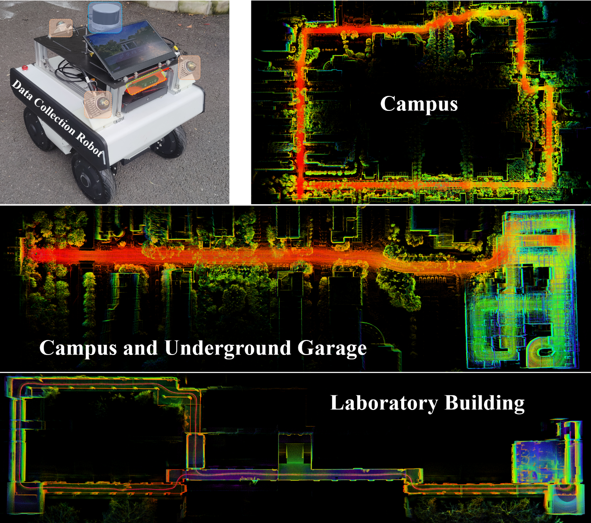

# InGM-LIO: A Multiscale Gaussian Model-Based LiDAR-Inertial Odometry Using Invariant Kalman Filtering

This repository contains the source code for our ICRA2025 paper **"InGM-LIO: A Multiscale Gaussian Model-Based LiDAR-Inertial Odometry Using Invariant Kalman Filtering"**. Our system combines a multiscale Gaussian model with tightly coupled LiDAR and IMU data using invariant Kalman filtering for accurate, efficient, and robust odometry.


**The code will release soon upen the paper be accepted.**


## Data Sequence Correspondence
In this project, we tested the following public datasets:
* M2DGR: https://github.com/SJTU-ViSYS/M2DGR.git
* NCLT: http://robots.engin.umich.edu/nclt/
* AVIA Dataset: https://github.com/ziv-lin/r3live_dataset   ([R3live](https://github.com/hku-mars/r3live.git))  
 
The following table shows the correspondence between the sequences used in the experiments and the results reported in the paper:

<table>
  <tr>
    <th style="text-align:center">Dataset</th>
    <th style="text-align:center">Sequence Abbreviation</th>
    <th style="text-align:center">Full Name</th>
    <th style="text-align:center">Duration (s)</th>
    <th style="text-align:center">Distance (km)</th>
    <th style="text-align:center">LiDAR Type</th>
  </tr>
  <tr>
    <td style="text-align:center">M2DGR</td>
    <td style="text-align:center">M.s1</td>
    <td style="text-align:center"><a href="https://sjtueducn-my.sharepoint.com/:u:/g/personal/594666_sjtu_edu_cn/EavjoipiTMRIjUvmodSGGsoB8rg0_pOkp6pqDScr8h4zvQ?e=OjtWkL" target="_blank">street_01</td>
    <td style="text-align:center">1028</td>
    <td style="text-align:center">0.75</td>
    <td style="text-align:center">Velodyne VLP-32C</td>
  </tr>
  <tr>
    <td style="text-align:center">M2DGR</td>
    <td style="text-align:center">M.s2</td>
    <td style="text-align:center"><a href="https://sjtueducn-my.sharepoint.com/:u:/g/personal/594666_sjtu_edu_cn/EQj5QBBHONpFj-hlvXOQBr0BM0NP9nhNuw-X9UtwOMMuNw?e=ZrxudN" target="_blank">street_02</td>
    <td style="text-align:center">1227</td>
    <td style="text-align:center">1.48</td>
    <td style="text-align:center">Velodyne VLP-32C</td>
  </tr>
  <tr>
    <td style="text-align:center">M2DGR</td>
    <td style="text-align:center">M.s3</td>
    <td style="text-align:center"><a href="https://sjtueducn-my.sharepoint.com/:u:/g/personal/594666_sjtu_edu_cn/EQU95R6TOAZIkaoFuHJLU-kB9qJEIDeEsECB3Gjc9Nmx8A?e=J1AKwY" target="_blank">street_03</td>
    <td style="text-align:center">354</td>
    <td style="text-align:center">0.42</td>
    <td style="text-align:center">Velodyne VLP-32C</td>
  </tr>
  <tr>
    <td style="text-align:center">M2DGR</td>
    <td style="text-align:center">M.s4</td>
    <td style="text-align:center"><a href="https://sjtueducn-my.sharepoint.com/:u:/g/personal/594666_sjtu_edu_cn/Ea72BxSXFYhDrp_FGNlJ2ukBx3CQSlv0Wah5nFUJtIntrw?e=4rwi7H" target="_blank">street_04</td>
    <td style="text-align:center">858</td>
    <td style="text-align:center">0.84</td>
    <td style="text-align:center">Velodyne VLP-32C</td>
  </tr>
  <tr>
    <td style="text-align:center">M2DGR</td>
    <td style="text-align:center">M.s5</td>
    <td style="text-align:center"><a href="https://sjtueducn-my.sharepoint.com/:u:/g/personal/594666_sjtu_edu_cn/EUClV6vL2zhAicOwwO1WiroBK-fPzTu8K8NtMfgdMAxIqw?e=r50mNo" target="_blank">street_05</td>
    <td style="text-align:center">469</td>
    <td style="text-align:center">0.42</td>
    <td style="text-align:center">Velodyne VLP-32C</td>
  </tr>
  <tr>
    <td style="text-align:center">M2DGR</td>
    <td style="text-align:center">M.s6</td>
    <td style="text-align:center"><a href="https://sjtueducn-my.sharepoint.com/:u:/g/personal/594666_sjtu_edu_cn/EZ4HAXvNQXRCgRKSLpE3yX0BsM24PkXwAd-NopVc7ueNzA?e=oUw91h" target="_blank">street_06</td>
    <td style="text-align:center">494</td>
    <td style="text-align:center">0.48</td>
    <td style="text-align:center">Velodyne VLP-32C</td>
  </tr>
  <tr>
    <td style="text-align:center">M2DGR</td>
    <td style="text-align:center">M.s8</td>
    <td style="text-align:center"><a href="https://sjtueducn-my.sharepoint.com/:u:/g/personal/594666_sjtu_edu_cn/EdgojePkM2ZNszS6JM80D90B-2q68wWQ1vZijzeaH-IQrw?e=iwVIiX" target="_blank">street_08</td>
    <td style="text-align:center">491</td>
    <td style="text-align:center">0.34</td>
    <td style="text-align:center">Velodyne VLP-32C</td>
  </tr>
  <tr>
    <td style="text-align:center">M2DGR</td>
    <td style="text-align:center">M.h1</td>
    <td style="text-align:center"><a href="https://sjtueducn-my.sharepoint.com/:u:/g/personal/594666_sjtu_edu_cn/EWQ2bcxWRgZLtK_eSIgnNmoB_ozAyXeEU_MmlVqPZeiB7Q?e=BKghlK" target="_blank">hall_01</td>
    <td style="text-align:center">351</td>
    <td style="text-align:center">0.21</td>
    <td style="text-align:center">Velodyne VLP-32C</td>
  </tr>
  <tr>
    <td style="text-align:center">M2DGR</td>
    <td style="text-align:center">M.h2</td>
    <td style="text-align:center"><a href="https://sjtueducn-my.sharepoint.com/:u:/g/personal/594666_sjtu_edu_cn/EQRFrzmO2BxFmeAZV_ifTpsBJjdIM7XjQAnmnuDdhE9-Vg?e=WDZwUt" target="_blank">hall_05</td>
    <td style="text-align:center">402</td>
    <td style="text-align:center">0.29</td>
    <td style="text-align:center">Velodyne VLP-32C</td>
  </tr>
  <tr>
    <td style="text-align:center">NCLT</td>
    <td style="text-align:center">N.01</td>
    <td style="text-align:center"><a href="http://robots.engin.umich.edu/nclt/#:~:text=%5Btop%5D-,Data,-Session" target="_blank">2012-01-15</td>
    <td style="text-align:center">6646</td>
    <td style="text-align:center">7.58</td>
    <td style="text-align:center">Velodyne HDL-32E</td>
  </tr>
  <tr>
    <td style="text-align:center">NCLT</td>
    <td style="text-align:center">N.02</td>
    <td style="text-align:center"><a href="http://robots.engin.umich.edu/nclt/#:~:text=%5Btop%5D-,Data,-Session" target="_blank">2012-04-29</td>
    <td style="text-align:center">2599</td>
    <td style="text-align:center">3.17</td>
    <td style="text-align:center">Velodyne HDL-32E</td>
  </tr>
  <tr>
    <td style="text-align:center">NCLT</td>
    <td style="text-align:center">N.03</td>
    <td style="text-align:center"><a href="http://robots.engin.umich.edu/nclt/#:~:text=%5Btop%5D-,Data,-Session" target="_blank">2012-05-11</td>
    <td style="text-align:center">5016</td>
    <td style="text-align:center">6.12</td>
    <td style="text-align:center">Velodyne HDL-32E</td>
  </tr>
  <tr>
    <td style="text-align:center">NCLT</td>
    <td style="text-align:center">N.04</td>
    <td style="text-align:center"><a href="http://robots.engin.umich.edu/nclt/#:~:text=%5Btop%5D-,Data,-Session" target="_blank">2012-06-15</td>
    <td style="text-align:center">3310</td>
    <td style="text-align:center">4.09</td>
    <td style="text-align:center">Velodyne HDL-32E</td>
  </tr>
  <tr>
    <td style="text-align:center">NCLT</td>
    <td style="text-align:center">N.05</td>
    <td style="text-align:center"><a href="http://robots.engin.umich.edu/nclt/#:~:text=%5Btop%5D-,Data,-Session" target="_blank">2013-01-10</td>
    <td style="text-align:center">1025</td>
    <td style="text-align:center">1.14</td>
    <td style="text-align:center">Velodyne HDL-32E</td>
  </tr>
  <tr>
    <td style="text-align:center">AVIA</td>
    <td style="text-align:center">A.c2</td>
    <td style="text-align:center"><a href="https://1drv.ms/f/c/3e715b7aa136191a/EqpK7QnN4OpCqHmL2ykpZ50Bjz3pyJ0kwyvwpBBLtzR4bQ?e=TqPN8E" target="_blank">hkust_campus_seq_02</td>
    <td style="text-align:center">323</td>
    <td style="text-align:center">0.35</td>
    <td style="text-align:center">Livox AVIA</td>
  </tr>
  <tr>
    <td style="text-align:center">AVIA</td>
    <td style="text-align:center">A.mb</td>
    <td style="text-align:center"><a href="https://1drv.ms/f/c/3e715b7aa136191a/EqpK7QnN4OpCqHmL2ykpZ50Bjz3pyJ0kwyvwpBBLtzR4bQ?e=TqPN8E" target="_blank">hku_main_building</td>
    <td style="text-align:center">1170</td>
    <td style="text-align:center">1.05</td>
    <td style="text-align:center">Livox AVIA</td>
  </tr>
  <tr>
    <td style="text-align:center">AVIA</td>
    <td style="text-align:center">A.p1</td>
    <td style="text-align:center"><a href="https://1drv.ms/f/c/3e715b7aa136191a/EqpK7QnN4OpCqHmL2ykpZ50Bjz3pyJ0kwyvwpBBLtzR4bQ?e=TqPN8E" target="_blank">hku_park_01</td>
    <td style="text-align:center">351</td>
    <td style="text-align:center">0.40</td>
    <td style="text-align:center">Livox AVIA</td>
  </tr>
  <tr>
    <td style="text-align:center">Ours</td>
    <td style="text-align:center">O.c1</td>
    <td style="text-align:center">campus</td>
    <td style="text-align:center">1111</td>
    <td style="text-align:center">1.72</td>
    <td style="text-align:center">Hesai XT16, Livox Mid-360</td>
  </tr>
  <tr>
    <td style="text-align:center">Ours</td>
    <td style="text-align:center">O.c2</td>
    <td style="text-align:center">campus_under_garage</td>
    <td style="text-align:center">1227</td>
    <td style="text-align:center">1.23</td>
    <td style="text-align:center">Hesai XT16, Livox Mid-360</td>
  </tr>
  <tr>
    <td style="text-align:center">Ours</td>
    <td style="text-align:center">O.lb</td>
    <td style="text-align:center">lab_building</td>
    <td style="text-align:center">472</td>
    <td style="text-align:center">0.32</td>
    <td style="text-align:center">Livox Mid-360</td>
  </tr>
</table>

## ECUST-Dataset
The data collection platform is a four-wheel independent steering robot equipped with a Hesai-XT16 LiDAR, three Livox-360 semi-solid-state LiDARs, an RGB camera, and an Xsens MTi-300 IMU. The data was collected along a trajectory that starts and ends at the same point.



### Dataset Download
At present, we have uploaded the dataset to [Baidu Cloud](https://pan.baidu.com/s/18TVygoaLQTda5qpqXs415g?pwd=i9m9), and other ways of obtaining it will be done soon.
```
LINK: https://pan.baidu.com/s/18TVygoaLQTda5qpqXs415g?pwd=i9m9
Extracted code: i9m9
```

### Data format
Each of our sequences is released as a simple rosbag file.

**campus.bag**
```
rosbag info campus.bag
-------------------------------------------------------
path:        campus.bag
version:     2.0
duration:    18:31s (1111s)
start:       Nov 01 2023 15:30:33.15 (1698823833.15)
end:         Nov 01 2023 15:49:04.62 (1698824944.62)
size:        71.8 GB
messages:    1222589
compression: none [44480/44480 chunks]
types:       livox_ros_driver2/CustomMsg [e4d6829bdfe657cb6c21a746c86b21a6]
             sensor_msgs/Image           [060021388200f6f0f447d0fcd9c64743]
             sensor_msgs/Imu             [6a62c6daae103f4ff57a132d6f95cec2]
             sensor_msgs/PointCloud2     [1158d486dd51d683ce2f1be655c3c181]
topics:      /camera/color/image_raw       33349 msgs    : sensor_msgs/Image          
             /hesai_front/pandar           11115 msgs    : sensor_msgs/PointCloud2    
             /imu/data                    444580 msgs    : sensor_msgs/Imu            
             /livox/imu_192_168_1_101     222284 msgs    : sensor_msgs/Imu            
             /livox/imu_192_168_1_150     222284 msgs    : sensor_msgs/Imu            
             /livox/imu_192_168_1_174     222284 msgs    : sensor_msgs/Imu            
             /livox/lidar_192_168_1_101    22230 msgs    : livox_ros_driver2/CustomMsg
             /livox/lidar_192_168_1_150    22229 msgs    : livox_ros_driver2/CustomMsg
```

**campus_under_garage.bag**
```
rosbag info campus_under_garage.bag 
-------------------------------------------------------
path:        campus_under_garage.bag
version:     2.0
duration:    20:27s (1227s)
start:       Nov 01 2023 15:49:56.82 (1698824996.82)
end:         Nov 01 2023 16:10:24.53 (1698826224.53)
size:        79.5 GB
messages:    1350383
compression: none [49135/49135 chunks]
types:       livox_ros_driver2/CustomMsg [e4d6829bdfe657cb6c21a746c86b21a6]
             sensor_msgs/Image           [060021388200f6f0f447d0fcd9c64743]
             sensor_msgs/Imu             [6a62c6daae103f4ff57a132d6f95cec2]
             sensor_msgs/PointCloud2     [1158d486dd51d683ce2f1be655c3c181]
topics:      /camera/color/image_raw       36836 msgs    : sensor_msgs/Image          
             /hesai_front/pandar           12279 msgs    : sensor_msgs/PointCloud2    
             /imu/data                    491073 msgs    : sensor_msgs/Imu            
             /livox/imu_192_168_1_101     245531 msgs    : sensor_msgs/Imu            
             /livox/imu_192_168_1_150     245530 msgs    : sensor_msgs/Imu            
             /livox/imu_192_168_1_174     245529 msgs    : sensor_msgs/Imu            
             /livox/lidar_192_168_1_101    24554 msgs    : livox_ros_driver2/CustomMsg
             /livox/lidar_192_168_1_150    24555 msgs    : livox_ros_driver2/CustomMsg
             /livox/lidar_192_168_1_174    24496 msgs    : livox_ros_driver2/CustomMsg
```

**lab_building.bag**
```
path:        lab_building.bag
version:     2.0
duration:    7:52s (472s)
start:       Jan 29 2024 11:03:26.71 (1706497406.71)
end:         Jan 29 2024 11:11:18.87 (1706497878.87)
size:        1.7 GB
messages:    103355
compression: none [1868/1868 chunks]
types:       livox_ros_driver2/CustomMsg [e4d6829bdfe657cb6c21a746c86b21a6]
             sensor_msgs/Imu             [6a62c6daae103f4ff57a132d6f95cec2]
topics:      /livox/imu_192_168_1_101     94428 msgs    : sensor_msgs/Imu            
             /livox/lidar_192_168_1_101    8927 msgs    : livox_ros_driver2/CustomMsg
```

## Details of Comparative Experiments
All the other open-source projects we tested, along with specific parameters and configurations, are available in the repository [comp-exp](https://github.com/Liansheng-Wang/comp-exp.git). All projects can be successfully compiled on an Ubuntu 20.04, ROS1, X64 system. Those interested can check the details there.

comp-exp: https://github.com/Liansheng-Wang/comp-exp.git

## Thanks
I would like to express my sincere gratitude to [Chengwei Zhao](https://github.com/chengwei0427), [Dongjiao He](https://github.com/Joanna-HE), [Shuai Liang](https://github.com/robot-dreamer) and [Chi Yan](https://github.com/yanchi-3dv) for their invaluable guidance and assistance on this paper.


## Paper Submission and Acceptance Progress

- **Initial Submission**: September 15, 2024 - Paper submitted to ICRA 2025. 
- **Under review**: October 1st, 2024.


## Ongoing Plan
- [ ] Validation of more publicly available datasets
- [ ] Update this project to be compatible with ROS2 Humble.


